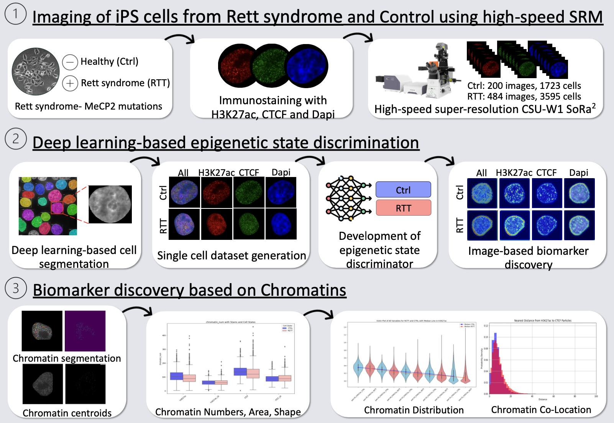
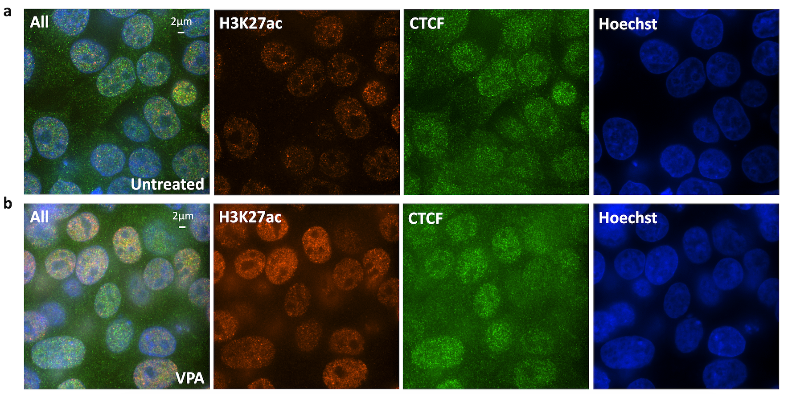
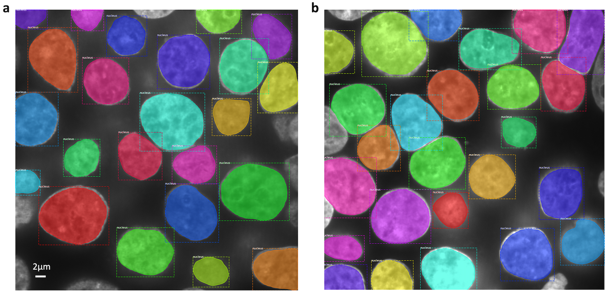
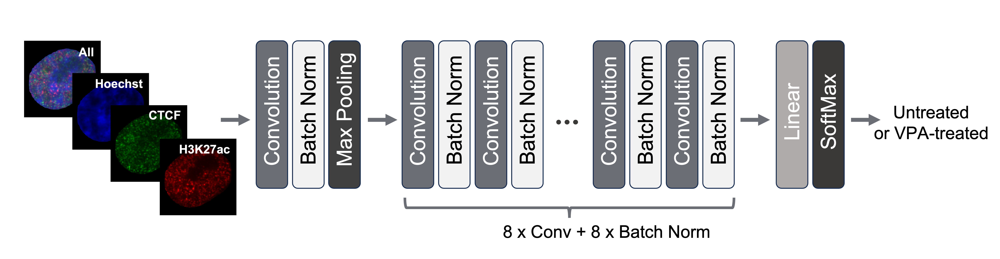
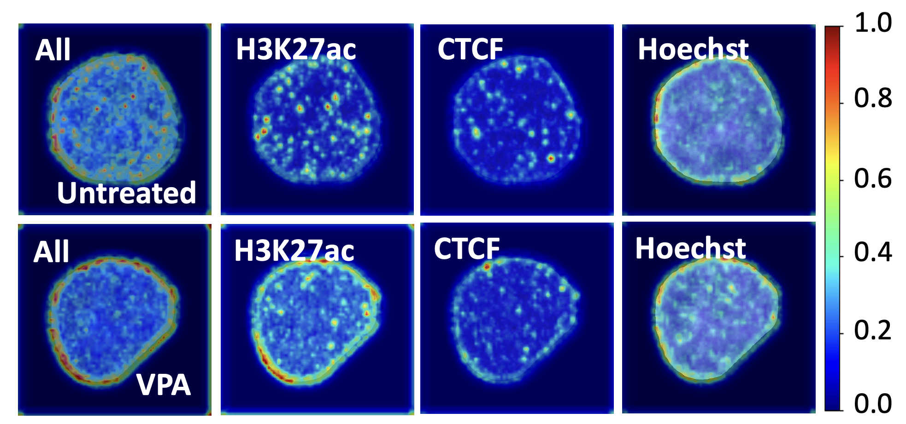

# **Image-based epigenetic profiling combining machine learning and high-speed super-resolution microscopy**

This code repostory is for image-based epigenetic profiling of our study, made by Yicheng Wang1,2†.

1. Graduate School of Frontier Sciences, The University of Tokyo, 5-1-5 Kashiwanoha, Kashiwa, Chiba 277-0882, Japan.

2. Artificial Intelligence Research Center, National Institute of Advanced Industrial Science and Technology (AIST), 2-4-7 Aomi, Koto-ku, Tokyo 135-0064, Japan.

   

### Abstract

Image-based profiling has been combined with machine learning for various tasks including cell classification and biomarker discovery. Epigenetic change within a cell nucleus can be captured by super-resolution microscopy (SRM), making it possible for image-based profiling. However, the low throughput of typical SRM has hindered its applications with machine learning. Here we employ a high-speed SRM called SoRa (Yokogawa CSU-W1) for image-based epigenetic profiling, and explore its applications to cell classification and biomarker discovery. As a model, HEK293T cells were treated with or without valproic acid (VPA), a histone deacetylase inhibitor to induce epigenetic change. The cells from each condition were stained for nuclear DNA (Hoechst), CTCF, and H3K27ac. 400 super-resolution images were obtained by SoRa within a day, and segmented into individual cell regions, yielding 6,944 cells in total. Using this large single-cell image dataset, we developed a deep learning method to discriminate the epigenetic states of cells (VPA-treated or not) with 99.6% accuracy. We also detected the image features that contributed to the discrimination as image-based biomarkers, suggesting the nuclear periphery as a hotspot of epigenetic change induced by VPA. To validate this image-based finding, we performed sequencing-based epigenomic analyses including Hi-C, ChIP-seq and RNA-seq. The integrative analysis with reported DamID data showed that genomic regions harboring epigenetic change were enriched in lamina-associated domains (LADs) at nuclear periphery, being consistent with the image-based finding. These results demonstrate the image-based epigenetic profiling combining SoRa and deep learning as a useful tool for cell classification and biomarker discovery.

### 1. Image acquisition by high-speed super-resolution microscope SoRa

Cells were imaged by Yokogawa CSU-W1 SoRa super-resolution spinning disc confocal system (Tokyo, Japan).

 

### Deep-learning-based segmentation of individual cell regions

Mask R-CNN [He et.al. IEEE 2017] was used for identifying different cell nuclei in a multi-cell image. Our Mask R-CNN model was trained using a public dataset, 2018 Data Science Bowl [Caicedo JC et.al. Nature methods 2019]. In following result sample, different color means different nuclears.

### Deep-learning-based discrimination of epigenetic states

For models, three kinds of CNN-based models were tested. Following figure only shows main model we used, ResNet model with 9 convolution layers and one fully-connected layer.

### Image-based biomarker discovery

We utilized Score-CAM [Wang H. et.al. IEEE 2020] to highlight crucial regions of cell images that influenced the  discrimination of the epigenetic states by our CNN models. The nuclear periphery shows higher intensities compared to inner-nucleus regions, which might be the potential biomarker for the epigenetic change induced by VPA treatment.

- The link of this paper: `will be updated later`.
- The image data of this study: `will be updated later`.
